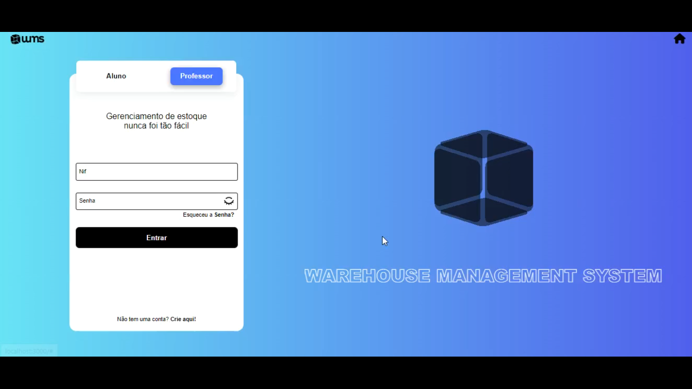
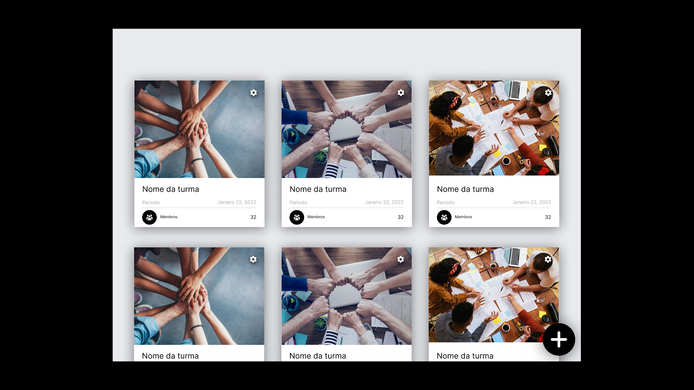
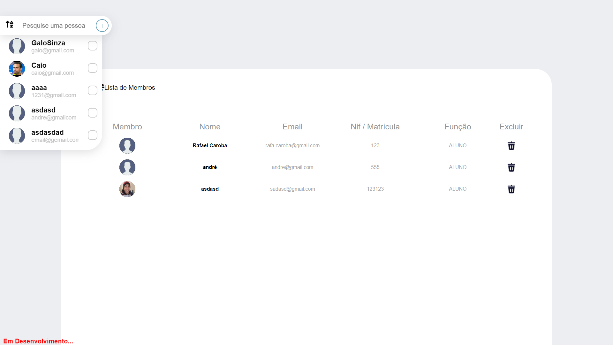
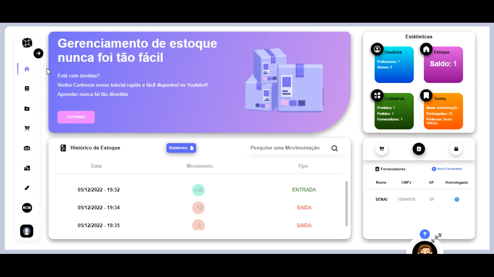

<h1>WMS-FrontEnd</h1>
 
O Sistema WMS (Warehouse Management System) foi feito com o intuito de auxiliar professores de logística em suas aulas de uma forma interativa e fácil simulando um ambiente de gerenciamento de armazém, contando com processos dês da entrega e armazenamento de produtos, até o picking e as movimentações dessas entregas.

Front-end Desenvolvido por: André Rodrigues e Caio Hoch

Back-end Desenvolvido por: Leandro Rocha, Bruno Vinicius e Renan Passos 
Link: https://github.com/Leandro5610/WMS

Mobile Desenvolvido por: Diogo Carpinelli e Rafael Caroba 
Link: https://github.com/diogocarp/WMS---Mobile

<h2>Telas</h2>

  <h3>Tela de Login</h3> 
   

  <h3>Tela de Cadastro</h3> 
   

  <h3>Tela de Turmas</h3> 
   

  <h3>Tela de Membros</h3> 
   

  <h3>Home</h3> 
   

  <h3>Tela de Cadastro de Fornecedores</h3> 
   

  <h3>Tela de Cadastro de Produtos</h3> 
   

  <h3>Tela de Pedidos</h3> 
   

Você também pode acessar nosso [TUTORIAL](https://youtu.be/WF6QeWmaB5c), onde são explicadas todas as funcionalidades do sistema.

